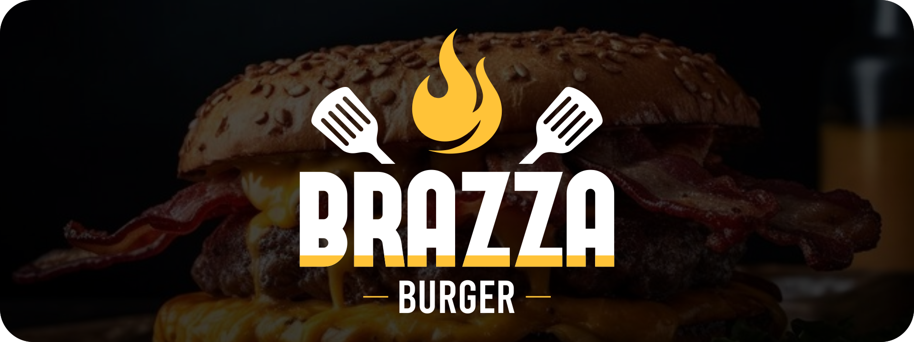

    <h1 align = center>Welcome to the Brazza Burger website!</h1>

    
A straightforward web application that offers users access to the complete menu and contact information.

     

    

    <h1 align = center> Main Uses </h1>

  
<b>Landing Page</b>

   
  
First of all, it can function as a landing page, which can be valuable for welcoming users to the company's brand. It can also help convey a professional image of the company to the customer.

   

  
<b>Digital Menu</b>

   
  
Provides the user with all the information they need about the burgers.

   

  
<b>Contact Method</b>

   
  
Provides users with all the contact methods and social media links of the company.

   

    <h1 align = center> Key Features </h1>

  
<b>Full Mobile Compatibility</b>

   
  
All features of the application function seamlessly on both desktop and mobile devices, with an interface that adapts to various screen dimensions.

   
  

    
  

  
<b>NavBar</b>

   
  
A navigation bar that helps users easily move around the website with more flexibility.

   

  
<b>Exploration section</b>

   
  
A section of the web app that allows users to easily scroll through the hamburgers, providing a convenient way to discover new menu options.

   

  
<b>Modal Cards</b>

   
  
A popup that overlays the whole page when a user selects a burger to know more about it. It enhances the search for information, making it more flexible and dynamic.

   

  
<b>Fast Contact</b>

   
  
Quick links that make the interaction between customers and the company much simpler and faster. Perfect for those who just want to grab lunch without any complications in the process.

   

    <h1 align = center>Deploy</h1>

    
Please, fell free to try it and explore all the features for yourself!

  
  <a href="https://brazzaburger.netlify.app/" style="display:inline-block; margin: 0 10px; color:rgb(255, 192, 74); outline:none; font-size: 30" align = center>https://brazzaburger.netlify.app/</a>

    <h1 align = center>Nerd Stuff</h1>

    
Here's a brief overview about the tech stack I used in this project and how it worked out for me.

   

  
    &nbsp;&nbsp;
  
    &nbsp;&nbsp;
  
    &nbsp;&nbsp;
  
    &nbsp;&nbsp;
  
    &nbsp;&nbsp;
  
    &nbsp;&nbsp;
  
    &nbsp;&nbsp;
  

   

  
<b>Front-End</b>

   
  
As my first React project, it was quite a challenge in my journey as a student. Before diving into this project, my knowledge of React.js was mostly theoretical. Starting a brand new project entirely with React was the best way to really get the hang of how the framework works.

  
  
In my opinion, the best way to learn something new is to get your hands dirty and deal  with the obstacles that pop up along the way. And that's exactly what this project allowed me to do.

  
I really enjoyed the concept of components and the underlying principle it introduces. I like to believe that challenging and complex problems are nothing more than a collection of simple and easy problems blended together.

   

  
<b>Back-End</b>

   
  
Even though it's quite humble and straightforward in this project, working with the Brazza Burger API marked my first time using Node.js. Before this project, my experience with APIs and backend development was limited to Java, using the Spring Framework. It was genuinely exciting to see how I could do the same things I learned in Java, but now using a different language and framework. I believe that learning can always be improved by trying various ways and approaches.

  
Nevertheless, I still struggle to fully grasp project patterns, and I recognize how crucial this is for my career as a FullStack developer. It's definitely one of the top three things I intend to dive deeper into in my upcoming projects.

 

  
<b>Data Base</b>

   
  
Although I'm not an expert in Structured Query Language (SQL), I felt quite comfortable with data modeling, and the entire process was a very interesting experience for me.

  
If I had to highlight some areas where I am inclined to learn more about, I would say it's the connection between the back-end and the database, as well as data security. Although my application doesn't have the capability to manipulate any data in my database, I'm concerned that there might be vulnerabilities in the requests that could potentially open the doors to attacks like SQL injections.

 

  
<b>Deploy</b>

   
  
I believe it was one of the most thrilling aspects of the project for me. Now, I can simply send a link to a friend and receive feedback just as easily!

  
It was a very challenging experience for me to figure out how to deploy the database into the AWS system, but once I got it done, it felt amazing. Definitely an area I want to learn more about!

  
I deployed the front-end using Netlify, and it wasn't a big deal; I was already comfortable with the tool, and it went smoothly. However, the back-end, which I deployed using Vercel, presented some challenges. But as soon as I got everything sorted out, it felt great. Seeing all three parts of my project working together, even though they are hosted on different platforms, was quite an achievement for me. It was a significant step forward!

   

  
      

    
I didn't provide an in-depth code explanation in this readme to keep it concise. However, I'd appreciate your input. Feel free to check out the code, and if you're interested, consider forking the project and contributing!

    <h1 style="font-size:40px;color:white;"> <b>Contact</b> Me!</h1>

    
Please feel free to contact me by any means below!

  
    &nbsp;
  
    &nbsp;
  
    &nbsp;
  

     
    
Thank you very much! <b>;D</b>

